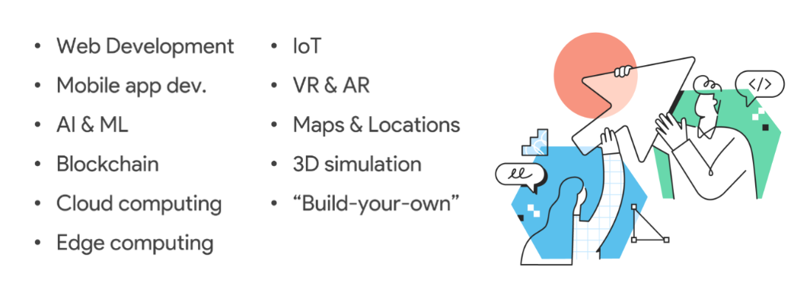

### Hi there 👋 I'm Ali 
Well, I'm a web app developer and I work with :
django-python, laravel-php, nodejs-javascript, reactjs, redux, nuxtjs, react-native and flutter(dart)

before programming I was a 3D artist years ago and now I can create 3D AR and VR commercial apps and 3D web experiences with the help of OpenGL and javascript. 
For some time, I was the technical lead of a startup tech company and because of my job in the field of smart city, I'm a little familiar with the technologies of maps and location services development, photogrammetry software, IoT and edge computing , self-driving cars ML, etc. which are all somehow related to the smart city, and sometimes I publish my codes as well.

