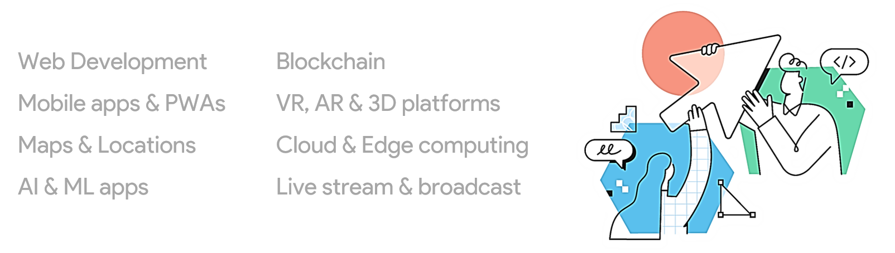

### Hi there 👋 I'm Ali 
Well, I'm a web app developer and I work with :
django, python, laravel, php, nodejs, javascript, reactjs, redux, nextjs, react-native

Here’s some of my favorite subjects that I tried make them only by Web technologies like JavaScript! That was a nice challenge that could improve my web development skills. Check out the Repos

before programming I was a 3D artist years ago and now I can create 3D AR and VR commercial apps and 3D web experiences with the help of WebGL and javascript

<!--

-->
